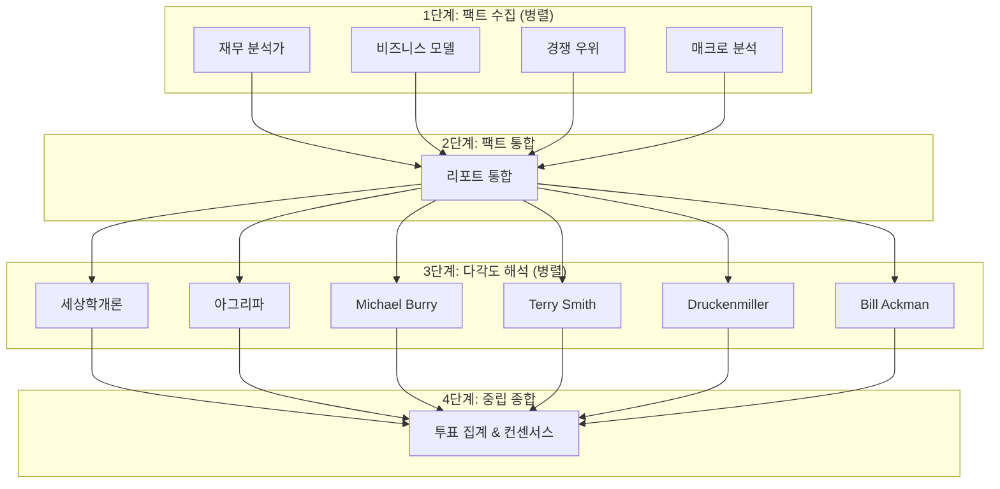

## 개요

최근 급변하는 트렌드를 빠르게 파악하려고 X 게시글을 많이 탐독하고 있다.
특히나 Claude Code 를 개발한 [Boris Cherny](https://x.com/bcherny)의 게시글을 재미있게 보고 있었는데, Claude Code 를 단순히 코드 뿐만이 아니라 다양한 분야에서 활용하는 것을 보고 큰 영감을 받았다.

웨딩 촬영 영상이 손상되어 이를 Claude Code 를 해결하거나, 주식 분석을 하는 등 꼭 코딩에 국한될 필요는 없어 보였다.

나도 AI Agent 를 열심히 써보고는 있지만, 대부분은 웹 기반의 서비스를 많이 이용해봐서 나도 Claude Code 를 사용해보기로 마음을 먹었고, 내가 관심이 많은 미국 주식과 관련되어서 활용해보려고 한다.

## 왜 Claude Code 로 주식을 분석하였는가?

나는 Gemini 사용자여서 처음에는 Gemini, Gemini CLI 를 활용하여 주식을 분석해볼까 싶었다.
Gemini 도 정말 좋지만 매우 아쉬웠던 점은 subagent 기능을 지원하지 않는다는 것이다.

subagent 를 활용할 경우, 각 에이전트들에게 페르소나를 할당하여 자신만의 컨텍스트 위에서 독립적인 작업을 맡길 수 있다.
각 독립적인 작업을 하나의 에이전트가 맡아서 할 경우, 컨텍스트가 섞여서 퀄리티가 낮은 분석 결과가 나오는 것을 많이 보았다.

## 분석 방법

주식 분석 방법은 4 단계로 구성했다.
각 단계는 모두 독립적인 subagent 로 구성이 되어 있어, 각자의 컨텍스트를 기반으로 동작한다.

### 1단계: 팩트 수집

- 재무제표 수집, 비즈니스 모델 파악, 경쟁 우위 파악, 미국의 매크로 경제 상황 파악을 각 에이전트가 병렬로 분석 수행
- 워렌 버핏, 찰리 멍거, 피터 린치 등의 페르소나를 주입하여 해당 투자자들이 중요시하는 항목을 중점적으로 보도록 설정

### 2단계: 팩트 통합

- 1단계에서 각 에이전트가 수집한 정보를 바탕으로 이를 요약하는 summary 자료 생성
- 이 단계의 에이전트는 별도의 페르소나가 주어지지 않음. 객관적인 시선으로 데이터만 통합하도록 함

### 3단계: 다각도 해석

- 내가 좋아하고, 존경하는(?) 투자자들의 페르소나를 기반으로 위의 요약 자료를 기반으로 주식 분석 실행
- 마찬가지로 투자자 별로 별도의 독립적인 서브에이전트로 실행 됨

### 4단계: 종합

- 3단계에서 각 에이전트가 수행한 주식 분석 결과를 바탕으로 종합적인 리포트를 생성
- 이 단계의 에이전트는 별도의 페르소나가 주어지지 않음. 객관적인 시선으로 데이터만 통합하도록 함

## 워크플로우

## 핵심 설계 원칙

| 원칙 | 설명 |
|------|------|
| **컨텍스트 분리** | 각 에이전트는 독립 실행, 서로의 결과를 모름 |
| **팩트와 해석 분리** | 1-2단계는 팩트만 수집, 3단계에서만 해석 |
| **다각도 관점** | 공격적(세상학개론, 아그리파) + 방어적(Burry, Smith) + 균형(Druckenmiller, Ackman) |
| **중립 종합** | 4단계에서는 어떤 페르소나도 주입하지 않고 순수 집계만 수행 |

## 왜 이렇게 설계했는가?

하나의 에이전트가 모든 분석을 수행하면 **컨텍스트가 섞여서** 품질이 떨어진다.
각 에이전트에게 명확한 역할을 부여하고, 독립적인 컨텍스트에서 작업하도록 하여 이 문제를 해결했다.

특히 3단계에서 **서로 다른 투자 철학**을 가진 6명의 페르소나를 병렬로 실행함으로써,
단일 관점의 편향을 방지하고 균형 잡힌 분석을 얻을 수 있었다.

## 분석 결과: IREN 분석 리포트

| 분석가 | 관점 | 판단 | 리포트 |
|--------|------|------|--------|
| **종합** | 6개 Persona 중립 집계 | 매수 2, 관망 1, 패스 2 | [보기]() |
| 세상학개론 | 내러티브 + 유동성 | 매수 | [보기]() |
| 아그리파 | 인프라 자산 | 매수 | [보기]() |
| Michael Burry | 역발상 + Deep Value | 패스 | [보기]() |
| Terry Smith | 품질 복리 | 패스 | [보기]() |
| Druckenmiller | 매크로 + 타이밍 | 조건부 매수 | [보기]() |
| Bill Ackman | 행동주의 + 집중 | 관망 | [보기]() |

## 후기

확실히 웹 기반의 AI Agent 를 활용하는 것 보다 훨씬 퀄리티 있는 결과가 나온다.
웹 에이전트도 컨텍스트를 물론 기억하긴 하지만, 내가 원하는 아키텍처를 설정하거나, 특정 데이터 플로우 흐름대로 커스터마이징 하는게 어려웠다.

무엇보다 서브에이전트 기능이 없다는 것이 웹 기반의 명확한 한계로 느껴졌다.
이러한 복잡한 작업에는 정말 서브에이전트 기능이 필수적이라고 느껴졌다.