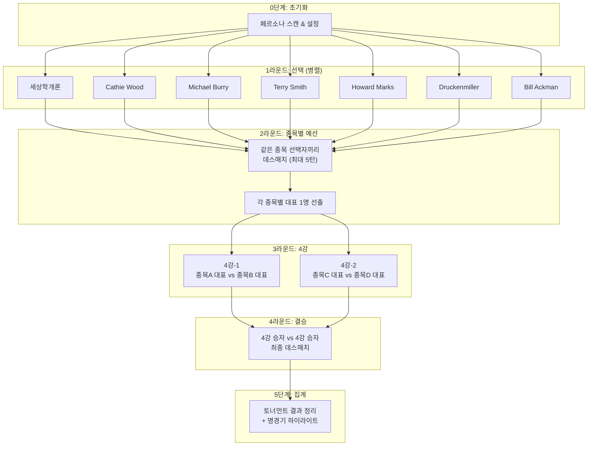
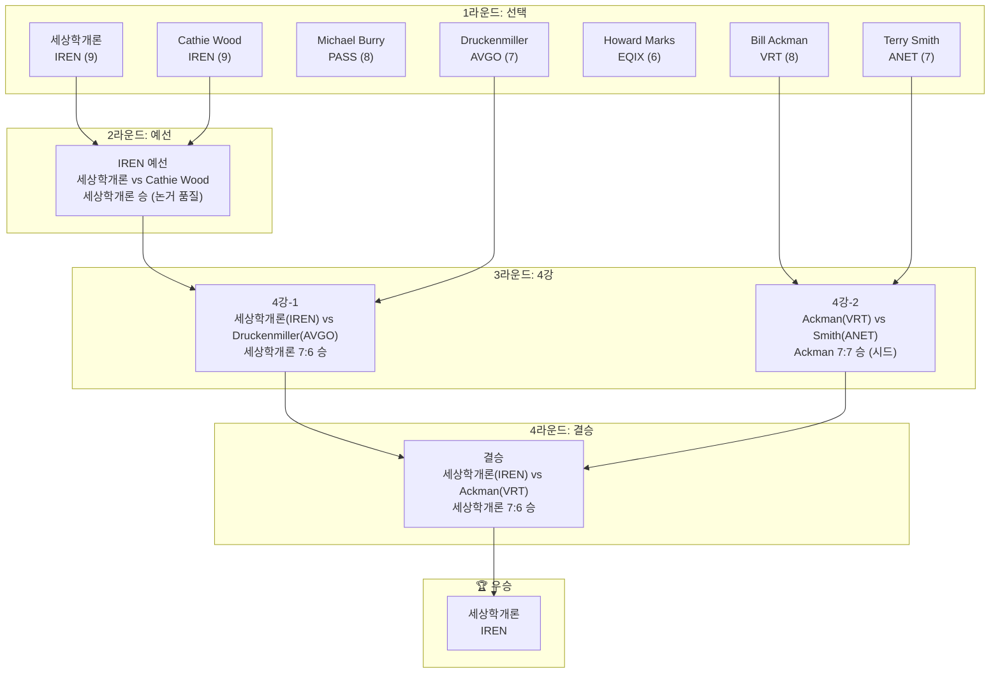

## 개요

내가 투자하려고 하는 주식의 테마에서 가장 유망한 종목을 고르는 일은 항상 너무나도 힘든 일입니다.

저는 특히나 욕심이 가득한 사람이라 하방이 닫혀있고, 안정적으로 우상향하는 주식을 원하지 않습니다.
저는 하방이 50~70% 이상 뚫려 있다고 하더라도, 상방이 5~10배 이상 갈 수 있는 종목을 투자하고 싶습니다.
인생을 바꿀 수 있는 투자를 지향하는 편입니다.

이러한 종목을 고르는 것은 항상 너무나도 어려운데요.
X 에서 게시글을 탐독하면서, 사람들이 claude code 를 정말 다양한 방식으로 실생활에 응용하는 것을 보고 갑자기 아이디어가 떠올랐습니다.

> 내가 주식 투자를 하는데 있어서 영감을 많이 주고, 내가 리스펙하는 투자자들이 내가 주식 투자하고 있는 테마 (AI 데이터센터) 에서 가장 유망한 종목을 고르도록 하면 어떨까?
> 
> 그리고 그 투자자들이 서로 싸우면서, 본인의 논리를 주장하고, 상대방의 논리에 대해서 반박하면 얼마나 재밌을까?

이 영감을 기반으로 바로 작업해 착수해봤습니다!

## 토너먼트 구성하기

저의 claude code 는 아래와 같은 투자자 페르소나가 존재합니다.
제가 평소 존경하고, 투자 포트폴리오를 많이 참고하는 투자자들입니다.

이 투자자들이 **AI 데이터센터** 분야에서 본인이 생각했을 때 가장 유망한 종목을 고르고,
그 고른 종목을 기반으로 토너먼트를 벌인다면 어떨까요? 너무 재미있어 보이지 않나요?

남의 투자 논리를 공격하고, 반박하면서 최종적으로 승복한 사람이 다음 라운드에 진출하고, 그렇게 최종 승자가 누가될 지 너무나도 궁금해졌습니다.

| 페르소나 | 설명 |
|--------|------|
| 세상학개론 | 3~5년간 10배 이상 먹을 수 있는 종목을 탐색하는 투자자 |
| Cathie Wood | 5년 후의 미래를 상상하는 파괴적 혁신 기업에 투자하는 투자자 |
| Michael Burry | 빅쇼트의 주인공 |
| Terry Smith | 영국의 워렌 버핏. Fundsmith 창립자이자, 운용자 |
| Druckenmiller | 30년간 단 한해도 손실없이 연평균 30% 수익을 달성한 전설적인 투자자 |
| Bill Ackman | 극닥적 집중 투자와 행동주의 전략으로 유명한 전설적인 투자자 |
| Howard Marks | 사이클 분석과 2차적 사고로 리스크 대비 수익을 극대화하는 투자자 |

## 토너먼트 구조

토너먼트는 총 5단계로 구성됩니다.
자세한 내용은 아래의 플로우 차트를 확인해주세요!

### 핵심 규칙

| 규칙 | 설명 |
|------|------|
| **컨텍스트 격리** | 각 페르소나는 독립된 Agent로 실행, 서로의 결과를 모름 |
| **데스매치** | 최대 5턴, 공격→반론 반복하며 확신도 변화 추적 |
| **승패 결정** | KO (확신도 3 이하), 판정승 (5턴 후 높은 쪽), 시드 어드밴티지 (동점 시) |

### 확신도 변화 기준

| 상황 | 변화 |
|------|------|
| 핵심 thesis 전제가 무력화됨 | **-2** |
| 데이터로 반박당함 | **-1** |
| 답변 못하는 질문 받음 | **-1** |
| 상대 논거를 수용함 | **-1** |
| 상대가 내 논거를 인정함 | **+1** |

## 토너먼트 결과

### 최종 승자

**세상학개론** - **IREN (Iris Energy)**

> "소버린 AI 시대 핵심 수혜주. 전력 인프라가 진짜 해자. 공급 불가능한 것을 공급하는 희소성 프리미엄. **냉각은 부품이고, IREN은 플랫폼.**"

| 항목 | 값 |
|------|-----|
| 최종 확신도 | 7/10 |
| 토너먼트 경로 | 예선 → 4강 → 결승 |
| 전적 | 3승 0패 |

**[최종 결과 상세 보기]()**

---

## 1라운드: 종목 선택

각 페르소나가 AI 데이터센터 섹터에서 최선의 종목을 선택한 결과입니다.

| 페르소나 | 선택 종목 | 확신도 | 핵심 thesis |
|----------|----------|--------|-------------|
| 세상학개론 | IREN | 9/10 | 소버린 AI 시대 핵심 수혜주, MS $9.7B 계약 |
| Cathie Wood | IREN | 9/10 | 파괴적 혁신의 정수, Wright's Law 작동 |
| Michael Burry | **PASS** | 8/10 | AI 버블 경고, 안전마진 없음 |
| Terry Smith | ANET | 7/10 | ROCE 27-33%, 무부채, FCF 마진 51% |
| Howard Marks | EQIX | 6/10 | 사이클 중후반 저평가 진입 |
| Druckenmiller | AVGO | 7/10 | AI 숨은 승자, VMware로 다각화 |
| Bill Ackman | VRT | 8/10 | 전력/냉각 병목 해결, $9.5B 백로그 |

**[1라운드 상세 보기]()**

### 대진표 생성

- **IREN 예선 필요**: 세상학개론(9) vs Cathie Wood(9) - 같은 종목 선택으로 대표 결정전 필요
- **본선 직행**: ANET, EQIX, AVGO, VRT (단독 선택)
- **불참**: Michael Burry (PASS 선택)

---

## 2라운드: IREN 예선

### 세상학개론 vs Cathie Wood

| 항목 | 세상학개론 | Cathie Wood |
|------|-----------|-------------|
| 시작 확신도 | 9/10 | 9/10 |
| 최종 확신도 | 9/10 | 9/10 |
| 결과 | **승** (판정) | 패 |

**핵심 승부처**: 5턴 최종 공격에서 세상학개론이 "Wright's Law가 전력 인프라 병목에 적용될 수 있는가?"라는 본질적 질문을 던졌고, Cathie Wood는 "아닙니다... 제가 이 프레임을 잘못 적용했습니다"라고 인정.

**명장면**:
> **Cathie Wood**: "파괴적 혁신 프레임워크로 모든 것을 설명하려 한 것은 제 습관적 오류입니다."

**[예선 경기 상세 보기]()**

---

## 3라운드: 4강

### 4강-1: 세상학개론(IREN) vs Druckenmiller(AVGO)

| 항목 | 세상학개론 | Druckenmiller |
|------|-----------|---------------|
| 시작 확신도 | 9/10 | 7/10 |
| 최종 확신도 | 7/10 | 6/10 |
| 결과 | **승** (판정) | 패 |

**핵심 승부처**: 세상학개론이 "AVGO 시총 1조 달러에서 10배는 10조 달러, 수학적으로 불가능"이라는 결정적 공격. Druckenmiller는 "AVGO는 이 게임의 규칙에 맞지 않는 선택입니다"라고 인정.

**명장면**:
> **Druckenmiller**: "솔직히 인정합니다. AVGO가 현재 시총에서 10배가 되는 현실적 시나리오는 없습니다."

**[4강-1 경기 상세 보기]()**

---

### 4강-2: Bill Ackman(VRT) vs Terry Smith(ANET)

| 항목 | Bill Ackman | Terry Smith |
|------|-------------|-------------|
| 시작 확신도 | 8/10 | 7/10 |
| 최종 확신도 | 7/10 | 7/10 |
| 결과 | **승** (시드) | 패 |

**핵심 승부처**: 5턴 완료 후 7:7 동점. 원래 확신도가 높았던 Ackman이 **시드 어드밴티지**로 승리.

**명장면**:
> **Terry Smith**: "Cisco CEO Chuck Robbins 본인이 '클라우드 인프라 플레이에서 참여하지 못했다'고 인정했습니다."
>
> **Bill Ackman**: "전력 인프라 수요는 AI 확산과 함께 구조적으로 확대되며, 이는 Network보다 더 긴 사이클입니다."

**[4강-2 경기 상세 보기]()**

---

## 4라운드: 결승

### 세상학개론(IREN) vs Bill Ackman(VRT)

| 항목 | 세상학개론 | Bill Ackman |
|------|-----------|-------------|
| 시작 확신도 | 7/10 | 7/10 |
| 최종 확신도 | **7/10** | 6/10 |
| 결과 | **우승** | 준우승 |

**핵심 승부처**: 4턴까지 7:7 동점 유지. 마지막 5턴에서 세상학개론이 **"냉각은 부품이고, IREN은 플랫폼"**이라는 결정적 프레이밍으로 공격. Bill Ackman은 이 프레이밍의 힘과 10배 수익 관점에서 IREN의 비대칭 상승 잠재력을 인정하며 확신도 1점 하락.

**명장면**:
> **세상학개론**: "VRT가 아무리 효율을 높여도, IREN처럼 '전력-연산-수익'을 수직 통합한 플레이어의 구조적 해자를 넘을 수 없습니다. **냉각은 부품이고, IREN은 플랫폼입니다.**"
>
> **Bill Ackman**: "VRT는 안정적이지만, **10배 수익을 노리는 공격적 투자자 관점에서 IREN의 비대칭적 상승 잠재력이 더 매력적일 수 있습니다.**"

**[결승 경기 상세 보기]()**

---

## 토너먼트 브라켓

---

## 종목별 최종 순위

| 순위 | 종목 | 대표 | 최고 라운드 | 핵심 강점 | 치명적 약점 |
|:----:|------|------|------------|----------|------------|
| 🥇 | **IREN** | 세상학개론 | **우승** | 전력 인프라 희소성, MS $9.7B 계약 | FCF 적자, 고객 집중도 |
| 🥈 | VRT | Bill Ackman | 준우승 | 열관리 통합 솔루션, $6.8B 백로그 | 부품 공급자 한계 |
| 3 | AVGO | Druckenmiller | 4강 | AI ASIC $73B 백로그 | 시총 1조로 10배 불가 |
| 4 | ANET | Terry Smith | 4강 | ROCE 27-33%, FCF 51% | 고객 집중 40% |
| 5 | EQIX | Howard Marks | 1라운드 | 사이클 저점 진입 | 금리 민감도 |
| - | PASS | Michael Burry | 불참 | AI 버블 경고 | 섹터 전체 회피 |

---

## 투자 시사점

### 1. 진짜 병목을 찾아라
AI 시대 데이터센터의 핵심 병목은 GPU도, 냉각도, 네트워킹도 아닌 **전력 그 자체**입니다. 전력망 인허가에 3-7년이 소요되는 현실에서, 이미 전력을 확보한 기업은 '공급 불가능한 것을 공급하는' 희소 자산을 보유한 것입니다.

### 2. 10배 게임의 수학
투자자 프로필이 "10배 수익"을 목표로 한다면, 출발점(시총)이 중요합니다:
- IREN 시총 ~$5B → 10배 = $50B (달성 가능)
- AVGO 시총 ~$1T → 10배 = $10T (수학적 불가능)
- VRT 시총 ~$45B → 10배 = $450B (매우 어려움)

### 3. 부품 vs 플랫폼
냉각, 네트워킹, 서버는 AI 인프라의 "부품"이고, 전력+연산+수익을 수직 통합한 IREN 같은 모델은 "플랫폼"입니다. 10배 수익 관점에서 플랫폼 플레이어가 더 큰 상승 잠재력을 가집니다.

### 4. 리스크 인지
IREN의 핵심 리스크:
- FCF 적자 지속
- Microsoft 단일 고객 집중 (매출 70%+)
- CapEx 집약적 구조와 유상증자 가능성
- AI 전환 실행 리스크

---

## 배틀 통계

| 항목 | 값 |
|------|-----|
| 총 참가 페르소나 | 7명 |
| 실제 종목 선택 | 6명 (Burry PASS) |
| 선택된 종목 수 | 5개 |
| 총 매치 수 | 4경기 (예선 1 + 4강 2 + 결승 1) |
| 총 턴 수 | 20턴 |

---

## 상세 리포트

모든 경기의 턴별 상세 기록을 확인할 수 있습니다.

| 라운드 | 경기 | 링크 |
|--------|------|------|
| 설정 | 배틀 설정 및 참가자 | [보기]() |
| 1라운드 | 종목 선택 | [보기]() |
| 2라운드 | 예선: 세상학개론 vs Cathie Wood | [보기]() |
| 3라운드 | 4강-1: 세상학개론 vs Druckenmiller | [보기]() |
| 3라운드 | 4강-2: Ackman vs Smith | [보기]() |
| 4라운드 | 결승: 세상학개론 vs Ackman | [보기]() |
| 최종 | 종합 결과 | [보기]() |

---

## 후기

Claude MAX 의 구독료가 부담되기는 하지만, 그래도 그 값어치는 톡톡히 하는 것 같습니다.

회사 동료분께서 해주신 말인데, 미래에는 이러한 구독료에 대한 부담의 차이가 역량의 차이가 나타날 날이 올 것 같다 라는 이야기를 해주셨는데요. 정말 맞는 말 같습니다.

AI 환경이 정말 지금도 급변하고 있고, 당장 내일만 되어도 새로운 제품과 모델이 쏟아져 나올 것입니다. 이러한 변화의 흐름을 잘 타서, 급변하는 시대에 살아 남는다면 큰 부를 이룰 수 있는 기회가 오지 않을까 합니다.

아무튼 공부를 절대 게을리 하면 안되는 시기인 것 같습니다.